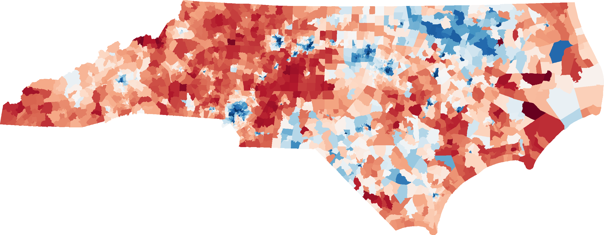
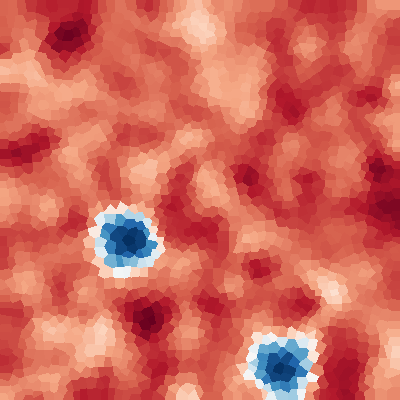

# Antimander
## Multi-Objective Optimization For Congressional Districts 🗺️👩‍💻🇺🇸

[Discord](https://discord.gg/UmgaE74)

The source code for the [Antimander.org](http://antimander.org/) website is here [github/joel-simon/Antimander-blog](https://github.com/joel-simon/Antimander-blog)


## Installation 
Requires python3
```
cd optimize
conda create -n antimander python=3.6 // Optional
pip install -r requirements.txt
conda install -c conda-forge pykdtree 
// May also install by source instead at https://github.com/storpipfugl/pykdtree
python setup.py build_ext -i
```

## Use Antimander via the scripts in /bin

### ./bin/sp2statefile
Converts a shapefile from the [mggg states repo](https://github.com/mggg-states/) to the Antimander state json format that incudes adjacency info. 

Example
```
./bin/shp2statefile --save -n WI -s ~/Downloads/WI_wards_12_16/WI_ltsb_corrected_final.shp
./bin/shp2statefile --save -n NC -s ~/Downloads/NC_VTD/NC_VTD.shp
```
This can take a few minutes and you there a pre-computed ones are available on google drive.
```
pip install gdown 
// WI.json.zip (Wisconsin)
gdown https://drive.google.com/uc?id=1afLh0gCfXqFI8NqRo0tyHWp7oPKxu4qQ

// NC.json.zip (North Carolina)
gdown https://drive.google.com/uc?id=1b-LZf91_ImtLuGQgj5kqaBlt53JM6Cj3
```
### ./bin/draw_state 
Draws a state json file to the window and saves it as a png.
```
./bin/draw_state data/NC.json
```


### ./bin/make_test_state
Create a fake test test state on a Voronoi grid. The number of cities and tiles is parameterized and the total populations for each party are normalized to be equal. This is useful for faster testing. The main dependency Pyvoro is known to cause issues sometimes.

Example
```
./bin/make_test_state -t 2000 -c 2 -s 2 -o data/t2000_c2.json
./bin/draw_state data/t2000_c2.json
```
And you should see




### ./bin/optimize
The main script that runs the optimization. "./bin/optimize --help" for full options.
Example: Optimizes with three metrics, "centers" novelty method and feasible-infeasible search:
```
./bin/optimize -i ./data/t2000_c2.json -o ../view/data/test_out -g 2000 -p 400 \
    --metrics polsby_popper efficiency_gap competitiveness \
    --novelty centers --feasinfeas
```
This will create an output directory and put a lot of output files and hypervolume plots there. If you output it to the viewer directory you can then interact with via the web viewer. For real states more generations and larger population size are suggested. ~600 pop and ~5000 gens are good but depends on the state and number of metrics. 

## Web Viewer
Requires node.js

NOTE: this viewer is deprecated since it is pretty slow for full state files but is fine for test states, the very fast WebGL viewer is in the website repo. TODO: merge them.
```
cd viewer
npm install
npm install budo -g
npm start
open http://localhost:9966/?run=test_out&stage=4
```
